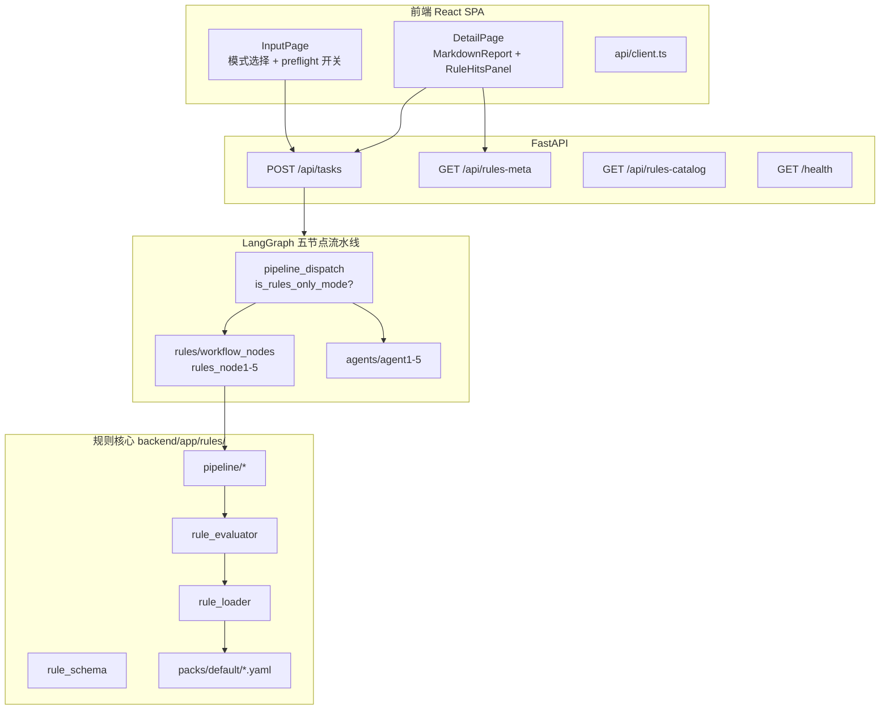
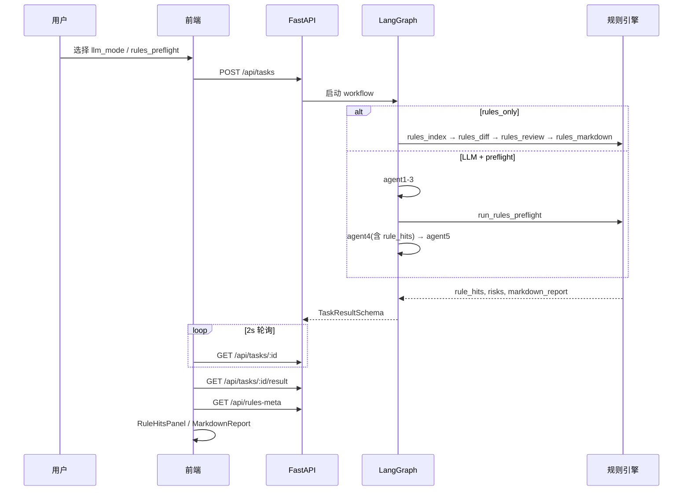
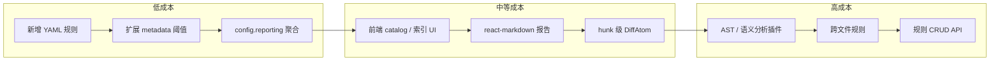

# 规则引擎深度审阅报告

更新时间：2026-05-30

> 本文档为架构审阅报告，聚焦设计分析、不足与演进建议。操作手册见 [V2.4_RULES_MODE.md](./V2.4_RULES_MODE.md)。

---

## 1. 执行摘要

本项目的规则引擎是一个 **YAML 驱动、与 LLM Agent 物理隔离** 的静态 PR 分析层，嵌入 LangGraph 五节点工作流，通过 `pipeline_dispatch` 在 rules / LLM 两套 pipeline 间切换。

**两种运行模式：**

| 模式 | 说明 |
|------|------|
| `rules_only` | 零 LLM、零 Ollama；五节点全走 `backend/app/rules/`，输出 Markdown 报告 + 结构化 `rule_hits` |
| `rules_preflight` | `cloud_only` / `hybrid` 可选；Agent4 前运行同一套规则引擎，将命中注入 LLM 上下文 |

**核心结论：**

- **优势**：架构清晰、模块边界明确；业务 regex 仅存在于 YAML，Python 侧为通用求值引擎；新增规则成本低；测试对默认规则包回归充分。
- **瓶颈**：纯 regex 匹配、每文件单一 DiffAtom 粒度、无跨文件/语义分析；前端规则展示与后端 schema 存在明显 gap。
- **定位**：适合离线 CI smoke、零 API 成本门禁；不宜作为大改动 PR 的唯一合并门禁（信噪比限制，见 [V2.4_RULES_MODE.md](./V2.4_RULES_MODE.md)）。

---

## 2. 系统架构

### 2.1 整体分层



### 2.2 关键设计决策

**双 pipeline 分发**

五节点（agent1–agent5）均经 `dispatch_node` 包装：当 `llm_mode == rules_only` 时走 rules 实现，否则走 LLM Agent。

```13:16:backend/app/graph/pipeline_dispatch.py
def dispatch_node(state: GraphState, rules_runner: NodeRunner, llm_runner: NodeRunner) -> GraphState:
    if is_rules_only_mode(state.get("llm_mode")):
        return rules_runner(state)
    return llm_runner(state)
```

**LLM 模式 preflight 注入**

`_llm_node4` 在 Agent4 前可选调用 `run_rules_preflight`，将 `rule_hits` 传入 Agent4 prompt，实现规则与 LLM 的轻量协同。

```68:86:backend/app/graph/workflow.py
        if state.get("rules_preflight_enabled"):
            from app.rules.pipeline.rules_preflight import run_rules_preflight

            hits, preflight_notes = run_rules_preflight(
                diff,
                state["pr_context"],
                review_depth_mode=state.get("review_depth_mode") or "balanced",
            )
            rule_hits.extend(hits)
        review, notes, review_stats = run_agent4(
            ...
            rule_hits=rule_hits or None,
        )
```

**业务 regex 隔离**

- `backend/app/agents/`：禁止 `RISK_KEYWORDS` / `_heuristic` 等启发式
- `backend/app/rules/`：允许通用求值引擎；业务 pattern **仅存在于 YAML**
- `test_rules_no_inline_patterns.py`：CI 门禁，防止 Python 内联业务 regex

**文案单源**

`backend/app/local/rule_meta.py` → `GET /api/rules-meta` → 前端 UI + `rules_markdown.py` 共用表头/章节文案，避免前后端硬编码漂移。

### 2.3 模块职责矩阵

| 模块 | 路径 | 职责 |
|------|------|------|
| **workflow 编排** | `backend/app/graph/workflow.py` | LangGraph 五节点；rules / LLM 双实现 |
| **pipeline 分发** | `backend/app/graph/pipeline_dispatch.py` | 按 `llm_mode` 路由节点实现 |
| **状态** | `backend/app/graph/state.py` | `GraphState`：`llm_mode`、`rule_hits`、`rules_preflight_enabled` 等 |
| **rule_loader** | `backend/app/rules/rule_loader.py` | 解析规则包目录、合并 YAML、`lint_rules`、路径/语言过滤 |
| **rule_schema** | `backend/app/rules/rule_schema.py` | Pydantic 模型、`MatchTarget` 枚举、severity→RiskLevel 映射 |
| **rule_pattern** | `backend/app/rules/rule_pattern.py` | 通用 `re.compile`（MULTILINE），无业务 pattern |
| **rule_evaluator** | `backend/app/rules/rule_evaluator.py` | `RuleContext` 构建、`atom × rule` 求值、metadata 阈值 |
| **rules_index** | `backend/app/rules/pipeline/rules_index.py` | 轻量结构索引（替代 Agent1/2） |
| **rules_diff** | `backend/app/rules/pipeline/rules_diff.py` | patch→DiffAtom（替代 Agent3） |
| **rules_review** | `backend/app/rules/pipeline/rules_review.py` | 规则求值→RiskReviewSchema（替代 Agent4） |
| **rules_aggregate** | `backend/app/rules/pipeline/rules_aggregate.py` | 命中→风险项，支持按 `rule_id` 分组 |
| **rules_markdown** | `backend/app/rules/pipeline/rules_markdown.py` | Markdown 报告（替代 Agent5 四图） |
| **rules_preflight** | `backend/app/rules/pipeline/rules_preflight.py` | LLM 模式 Agent4 前预检 |
| **workflow_nodes** | `backend/app/rules/workflow_nodes.py` | rules 模式 agent1–5 等价实现 |
| **rule_meta** | `backend/app/local/rule_meta.py` | UI / Markdown 文案单源 |
| **默认规则包** | `backend/app/rules/packs/default/` | 14 条规则 + `config.yaml` + `index_hints.yaml` |

### 2.4 端到端数据流



**核心求值循环：**

```
pr_context → build_rule_context() → RuleContext
           → run_rules_diff() → DiffAtom[]（每文件 1 atom，上限 max_atoms_per_run）
           → 对每个 atom × 每条 rule → evaluate_rule_on_atom()
           → RuleHitRecord[] → aggregate_risks_from_hits() → RiskItem[]
           → rules_markdown / TaskResultSchema
```

---

## 3. 技术栈

### 3.1 后端

| 层级 | 技术 |
|------|------|
| Web 框架 | FastAPI + uvicorn |
| 工作流 | LangGraph `StateGraph` |
| 数据校验 | Pydantic v2 |
| 规则格式 | PyYAML |
| 匹配引擎 | Python `re`（无 tree-sitter / AST） |
| 测试 | pytest + pytest-asyncio + TestClient |

### 3.2 前端

| 层级 | 技术 |
|------|------|
| 框架 | React 18.3 + TypeScript 5.6 |
| 构建 | Vite 5.4 |
| 路由 | react-router-dom 6.28 |
| 图表 | mermaid 11.4（`rules_only` 模式不使用） |
| 状态管理 | 组件内 `useState` / `useEffect`，无 Redux/Zustand |
| UI | 原生 HTML + CSS，无组件库 |

### 3.3 前后端集成

开发时 Vite 将 `/api`、`/health` 代理到 `http://localhost:8000`。

| 端点 | 前端使用 | 说明 |
|------|----------|------|
| `GET /api/rules-meta` | DetailPage | 文案、表头、默认分组行为 |
| `GET /api/rules-catalog` | **未使用** | 规则 id/message/severity（不含 pattern） |
| `GET /api/llm-mode-options` | InputPage | `rules_only` + `rules_preflight_toggle` |
| `POST /api/tasks` | InputPage | `llm_mode` + `rules_preflight_enabled` |
| `GET /api/tasks/:id/result` | DetailPage | `rule_hits` + `markdown_report` + index |
| `GET /health` | **未使用** | `rules_count`、`rules_invalid_count` |

**前端展示双轨：**

| 路径 | 组件 | 数据源 | 能力 |
|------|------|--------|------|
| 结构化 | `RuleHitsPanel.tsx` | `TaskResult.rule_hits` | 严重级别筛选、按规则分组、折叠 LOW |
| Markdown | `MarkdownReport.tsx` | `TaskResult.markdown_report` | 按 `##` 分段标题，**不渲染表格** |

---

## 4. 规则设定

### 4.1 规则 DSL

规则结构由 `RuleDefinition`（Pydantic）定义，YAML 中 pattern 字段使用 kebab-case `pattern-regex`。

**MatchTarget 枚举（8 种）：**

```11:19:backend/app/rules/rule_schema.py
MatchTarget = Literal[
    "patch_hunk",
    "file_path",
    "diff_atom",
    "change_type",
    "removed_lines",
    "pr_title",
    "pr_body",
]
```

**patch_scope**（仅 `patch_hunk` 生效）：`added_only`（默认）、`removed_only`、`full_patch`

**match 组合：**

- `match.any`：任一子句命中即触发
- `match.all`：全部子句命中才触发（示例：`dockerfile-root-user`）

**metadata 阈值**（无 regex 亦可触发，须在包级白名单内）：

| 键 | 语义 |
|----|------|
| `min_added_lines` | 新增行数下限 |
| `min_removed_lines` | 删除行数下限 |
| `min_changed_lines` | 新增+删除总和下限 |
| `min_removed_ratio` | `removed / (added+removed)` 下限 |
| `min_removed_over_added` | `removed >= added * 值` |
| `requires_removed_signal` | 无删除行则不触发 |
| `suggestion` | 命中后写入风险建议文案 |
| `evidence_include_summary` | 证据中拼接 atom.summary |

**包级配置**（`config.yaml`）：

```1:23:backend/app/rules/packs/default/config.yaml
config:
  scope:
    ignore_path_patterns:
      - "**/node_modules/**"
      ...
    max_atoms_per_run: 200
  metadata_allowed_keys:
    - min_added_lines
    ...
  reporting:
    group_risks_by_rule_id: true
    max_files_listed_per_risk: 15
    evidence_include_atom_summary: true
    grouped_evidence_suffix: "等共 {count} 个文件"
```

### 4.2 默认规则包（14 条）

| 文件 | 规则 ID | 类别 |
|------|---------|------|
| `security.secrets.yaml` | `patch-hardcoded-secret`, `env-file-committed` | 密钥泄露 |
| `security.patterns.yaml` | `sql-string-concat`, `eval-or-exec`, `dangerous-html-react` | 危险模式 |
| `api_route.yaml` | `route-decorator-changed`, `auth-middleware-touched` | API / 鉴权 |
| `change_surface.yaml` | `large-patch-hunk`, `ci-config-changed`, `dockerfile-changed`, `dockerfile-root-user`, `test-file-removed` | 变更面 |
| `dependency.yaml` | `lockfile-changed`, `requirements-unpinned` | 依赖 |
| `index_hints.yaml` | — | 入口文件发现 hint（非规则） |

**规则示例（metadata 阈值 + match.all 组合）：**

```31:43:backend/app/rules/packs/default/change_surface.yaml
  - id: dockerfile-root-user
    message: Dockerfile 新增 USER root，存在特权运行风险
    severity: HIGH
    ...
    match:
      all:
        - pattern-regex: '.+'
          target: file_path
        - pattern-regex: 'USER\s+root'
          target: patch_hunk
          patch_scope: added_only
```

### 4.3 规则包路径解析

优先级（`rule_loader.resolve_rules_pack_dir()`）：

1. 环境变量 `RULES_PACK_PATH`
2. `settings.rules_pack_path`
3. `backend/app/rules/packs/default/`
4. 旧路径兼容 `backend/rules/default`

---

## 5. 测试覆盖评估

### 5.1 覆盖较好

| 测试文件 | 覆盖范围 |
|----------|----------|
| `test_rules_engine.py` | 加载、diff 解析、密钥检测、零 LLM 调用 |
| `test_rules_regression.py` | 默认规则包正/负例、阈值、聚合、`match.all` |
| `test_rules_lint.py` | `load_rule_pack_with_lint`、无效 regex 检测 |
| `test_rules_meta_api.py` | `/api/rules-meta`、`/api/rules-catalog` |
| `test_rules_preflight.py` | preflight 命中、prompt 格式化 |
| `test_rules_linkage.py` | `/health` 规则诊断、创建 rules_only 任务 |
| `test_rules_no_inline_patterns.py` | Python 模块不得内联业务 regex |
| `test_workflow_rules_only.py` | 端到端 LangGraph → markdown + rule_hits |

### 5.2 覆盖薄弱

- `rules_index` 独立单测较少
- `rules_markdown` 输出格式细节
- 自定义 `RULES_PACK_PATH` 外部包
- `LOCAL_PATH` 输入（patch 为空）下的行为
- Agent4 与 preflight 的集成 E2E
- 前端 `RuleHitsPanel` 无单测；无含 `rule_hits` 的 Detail 集成测
- 并发 / 性能 / 大 PR 压测

---

## 6. 不足分析

### 6.1 后端引擎层

| 编号 | 不足 | 严重度 | 说明 |
|------|------|--------|------|
| B1 | 纯 regex，无语义分析 | 高 | 无法做类型感知、数据流、跨函数调用；误报/漏报依赖 pattern 质量 |
| B2 | DiffAtom 粒度粗 | 高 | 每文件 1 atom，大文件多 hunk 合并，无法按 hunk 独立匹配 |
| B3 | atom 上限 200 | 中 | 超出截断并写 degradation note，大 PR 可能漏检 |
| B4 | LOCAL_PATH 输入弱 | 中 | patch 常为空，patch 类规则难以触发 |
| B5 | 语言推断简单 | 低 | 仅按扩展名，`.vue` 等未覆盖 |
| B6 | 无规则优先级/禁用 | 中 | 不能运行时按项目类型切换子集 |
| B7 | 无热加载/watch | 低 | 改 YAML 依赖进程重启或每次 `load_rule_pack()` 读盘 |
| B8 | severity 映射硬编码 | 低 | `_SEVERITY_TO_RISK` 在 `rule_schema.py` 中固定 |
| B9 | catalog 不暴露 lint 详情 | 低 | API 有 `rules_invalid_count`，但 lint issue 列表未对外暴露 |
| B10 | 信噪比 | 中 | 大 PR 仍可能多条 MEDIUM/HIGH，不宜作为唯一门禁 |

**B2 代码依据** — `rules_diff` 对每个 patch 文件生成单一 DiffAtom：

```47:59:backend/app/rules/pipeline/rules_diff.py
    for idx, patch in enumerate(patches):
        if len(atoms) >= max_atoms:
            notes.append(f"差异原子已达上限 {max_atoms}，后续文件未展开")
            break
        file_path = str(patch.get("filename") or f"file_{idx}").replace("\\", "/")
        ...
        patch_text = str(patch.get("patch") or "")
        if patch_text:
            summary, excerpt, added, removed = _summarize_patch(patch_text)
        else:
            summary, excerpt, added, removed = "文件级变更", "", 0, 0
```

**B1 代码依据** — 求值核心为 `_evaluate_clause` 中的 regex 分支，无 AST 插件点：

```101:155:backend/app/rules/rule_evaluator.py
def _evaluate_clause(
    clause: RuleMatchClause,
    ...
) -> str | None:
    pattern = compile_pattern(clause.pattern_regex)
    ...
    if target == "file_path":
        return _match_text(pattern, file_path)
    ...
    # patch_hunk：按 patch_scope 选择匹配文本
    hunk_text = _patch_hunk_text(...)
    ...
```

### 6.2 前端展示层

| 编号 | 不足 | 严重度 | 说明 |
|------|------|--------|------|
| F1 | Detail 加载耦合过强 | 高 | `!ui \|\| !diagramMeta` 门禁，`rules_only` 仍强制拉 diagramMeta |
| F2 | 规则命中与 Markdown 重复 | 中 | rules_only 下「规则报告」与「规则命中」Tab 内容高度重叠 |
| F3 | 字段利用不完整 | 中 | `message`、`base_index`/`head_index`、`rules_pack_version`、`table_change_headers` 未展示 |
| F4 | RuleHitsPanel 列写死 | 中 | 4 个 `<td>` 硬编码，非 headers 驱动渲染 |
| F5 | MarkdownReport 过简 | 高 | 规则模式核心交付物不渲染表格 |
| F6 | 无规则治理 UI | 中 | 未接 catalog、lint、health 诊断 |
| F7 | 类型重复 | 低 | `RuleHitRecord` 在 client.ts 与 RuleHitsPanel 各一份 |
| F8 | 大规模命中无虚拟化 | 低 | 全量渲染，无分页/虚拟滚动 |
| F9 | 测试覆盖不足 | 中 | 无 RuleHitsPanel 单测，无含 rule_hits 的 Detail 集成测 |

**F1 代码依据：**

```120:122:frontend/src/pages/DetailPage.tsx
  if (!ui || !diagramMeta) {
    return <MetaLoading />;
  }
```

**F4 代码依据：**

```85:94:frontend/src/components/RuleHitsPanel.tsx
  const renderRow = (hit: RuleHitRecord, index: number) => (
    <tr key={`${hit.rule_id}-${hit.file_path}-${index}`}>
      <td ...>{hit.rule_id}</td>
      <td ...>{hit.severity}</td>
      <td ...>{hit.file_path}</td>
      <td ...>{hit.evidence.slice(0, 200)}</td>
    </tr>
  );
```

注意：`RuleHitRecord` 含 `message` 字段，但 UI 未渲染。

---

## 7. 可扩展点

### 7.1 低成本（YAML / 配置级，无需改 Python）

| 扩展方式 | 说明 |
|----------|------|
| 新增规则 | 在 `packs/default/` 或 `RULES_PACK_PATH` 目录加 YAML |
| metadata 阈值规则 | 无 regex 触发（如 `large-patch-hunk`） |
| match 组合 | `any` / `all` + 多 target + `patch_scope` |
| 报告聚合 | `config.reporting` 控制分组、文件列表上限、证据后缀 |
| 文案 / i18n | 扩展 `rule_meta.py` + `/api/rules-meta` ui_strings |
| 质量 KPI | `quality_kpi` 已支持 `rule_hits_by_rule_id`、`distinct_risk_titles_ratio` 等 |
| preflight 集成 | cloud/hybrid 开启 `rules_preflight_enabled` |
| lint 门禁 | health/catalog 的 `rules_invalid_count` 可用于 CI |

### 7.2 中等成本（API / 前端级）

| 扩展方向 | 现有基础 |
|----------|----------|
| 规则目录页 | 直接新增 `fetchRulesCatalog()` 接 `GET /api/rules-catalog` |
| 索引可视化 | `TaskResult.base_index` / `head_index` 已在 schema 中 |
| 变更表组件 | 复用 `table_change_headers` + diff_atoms |
| 命中表增强 | 展示 `message` 列；headers 驱动渲染 |
| rules_only 解耦 diagramMeta | Detail 页按 `llm_mode` 条件加载 meta |
| 富 Markdown | 引入 react-markdown 等增强 `MarkdownReport` |

### 7.3 扩展成本示意



---

## 8. 难以扩展点

| 能力 | 原因 | 改造量级 |
|------|------|----------|
| 新 match target | 需改 `MatchTarget` 枚举 + `rule_evaluator._evaluate_clause` 分支 | 中 |
| 非 regex 匹配器 | 引擎只支持 `pattern-regex`；AST / YAML diff / 依赖图需新 evaluator 插件 | 大 |
| 跨文件 / 跨 atom 规则 | 当前 `atom × rule` 笛卡尔积，无全局状态 | 大 |
| 自定义聚合策略 | 除 `group_risks_by_rule_id` 外难以配置 | 中 |
| 规则间依赖 / 覆盖 | 无 suppress / override / depends_on 机制 | 大 |
| 多规则包合并 | 只支持单目录 glob，不支持多 pack 叠加或继承 | 中 |
| 实时规则编辑 API | 无 CRUD 端点，只能改文件系统 | 大 |
| LLM 双向反馈 | preflight 单向注入；规则引擎不从 LLM 输出学习 | 大 |
| hunk 级匹配 | 需重构 `rules_diff` 的 atom 拆分策略 | 大 |
| 前端列 / schema 任意扩展 | `RuleHitsPanel` 写死 4 列 | 中 |
| 富 Markdown 报告 | 需引入解析库并重写 `MarkdownReport` | 中 |
| severity 自定义映射 | `_SEVERITY_TO_RISK` 硬编码 | 低–中 |

---

## 9. 演进建议

按优先级排列的改进路线：

### 9.1 短期（1–2 周）

1. **Detail 页 meta 解耦**：`rules_only` 模式下不强制等待 `diagramMeta`，避免无意义加载阻塞。
2. **RuleHitsPanel 增强**：展示 `message` 列；复用 `client.ts` 的 `RuleHitRecord` 类型，消除重复定义。
3. **减少双轨重复**：`rules_only` 下考虑合并「规则报告」与「规则命中」Tab，或在 Markdown 报告中提供锚点跳转。

### 9.2 中期（约 1 月）

1. **引入 react-markdown**：让规则模式核心交付物可渲染表格与列表。
2. **规则目录页**：接 `GET /api/rules-catalog`，提供规则浏览与 lint 状态展示。
3. **hunk 级 DiffAtom**：重构 `rules_diff`，支持大文件多 hunk 独立匹配。
4. **索引可视化**：消费 `base_index` / `head_index`，展示入口文件与模块结构。

### 9.3 长期（架构级）

1. **evaluator 插件机制**：支持 AST（tree-sitter）、YAML 结构 diff、依赖图等非 regex 匹配器。
2. **多 pack 合并**：支持基础包 + 项目定制包叠加，含 inherit / override 语义。
3. **规则 CRUD API**：运行时规则管理、版本化、A/B 测试。
4. **跨 atom 规则引擎**：引入全局上下文（如「同一 PR 内 secret + config 同时变更」类规则）。

---

## 10. 附录：关键文件索引

| 文件 | 角色 |
|------|------|
| [backend/app/graph/workflow.py](../backend/app/graph/workflow.py) | LangGraph 编排 + preflight 注入 |
| [backend/app/graph/pipeline_dispatch.py](../backend/app/graph/pipeline_dispatch.py) | rules / LLM 双 pipeline 分发 |
| [backend/app/rules/rule_loader.py](../backend/app/rules/rule_loader.py) | 规则包加载与 lint |
| [backend/app/rules/rule_evaluator.py](../backend/app/rules/rule_evaluator.py) | 规则求值核心 |
| [backend/app/rules/rule_schema.py](../backend/app/rules/rule_schema.py) | DSL schema 定义 |
| [backend/app/rules/pipeline/rules_diff.py](../backend/app/rules/pipeline/rules_diff.py) | patch → DiffAtom |
| [backend/app/local/rule_meta.py](../backend/app/local/rule_meta.py) | 文案单源 |
| [backend/app/api/routes/rules_meta.py](../backend/app/api/routes/rules_meta.py) | rules-meta / rules-catalog API |
| [frontend/src/api/client.ts](../frontend/src/api/client.ts) | 前端 API 与类型 |
| [frontend/src/components/RuleHitsPanel.tsx](../frontend/src/components/RuleHitsPanel.tsx) | 命中表 UI |
| [frontend/src/pages/DetailPage.tsx](../frontend/src/pages/DetailPage.tsx) | 结果页与规则 Tab |
| [frontend/src/pages/InputPage.tsx](../frontend/src/pages/InputPage.tsx) | 预检开关与任务创建 |
| [docs/V2.4_RULES_MODE.md](./V2.4_RULES_MODE.md) | 操作手册与 DSL 参考 |

---

## 11. 总结

规则引擎在本项目中扮演 **YAML 驱动的静态 PR 分析层** 角色，与 LLM Agent 通过 LangGraph 双 pipeline 优雅共存：

- **`rules_only`** 提供零 token 的离线审阅能力，适合 CI smoke 与成本敏感场景。
- **`rules_preflight`** 在 LLM 审阅前注入结构化命中，提升 cloud/hybrid 模式的确定性。

架构上，**数据与逻辑分离**（pattern 在 YAML、Python 为通用引擎）是最大亮点，配合 lint 门禁与回归测试，保证了规则包的可维护性。主要瓶颈在于 **regex-only 表达能力** 与 **单 atom 粒度**，若要走向企业级 SAST，需要在 evaluator 插件、hunk 拆分、跨文件分析等方向做引擎级改造；前端则需在 Markdown 渲染、规则治理 UI、meta 加载解耦等方面补齐与后端 schema 的对齐。
