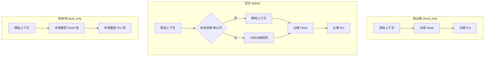

# v2.2 LLM Provider 抽象与推理模式

更新时间：2026-05-29  
前提：v2.0 功能归零（[V2_COMPLIANCE.md](./V2_COMPLIANCE.md)）、v2.1 质量 KPI 与审阅深度已落地（[V2.1_QUALITY.md](./V2.1_QUALITY.md)）。

---

## 0. 全局强制约束（所有章节适用）

**[强制·不得硬编码]** 本版本所有实现必须遵守：

| 禁止项 | 要求 |
|--------|------|
| 厂商/模型名写死在业务代码 | 云端 base URL、API Key、Flash/Pro 模型名、本地模型名 **仅来自 env 或任务请求/API 下发** |
| 前端文案硬编码 | 三档模式 label/summary/warning/压缩开关文案 **仅来自 `GET /api/llm-mode-options`**（与 `review_depth` 同规） |
| 业务关键词/路径规则 | Agent 主链路禁止 `RISK_KEYWORDS`、`_heuristic`、`diagram_from_modules` 等（沿用 v2.1） |
| 压缩层产出业务结论 | 压缩只输出纯文本，禁止 risks、风险等级、模块判定 |
| Provider 与 Agent 耦合 | Agent 1～5 只调 `call_flash_json` / `call_pro_json`，不得直接 import DeepSeek/Ollama |
| 静默降级假数据 | 路由/压缩失败写入 `degradation_notes` 或 4xx，禁止伪造审阅结论 |

**审计命令（CI/验收必跑）**：

```powershell
rg "RISK_KEYWORDS|_heuristic|diagram_from_modules" backend/app/agents
rg "deepseek-chat|deepseek-reasoner|qwen2\.5" backend/app --glob "!*.md"
# 期望：agents 无匹配；app 内模型名仅出现在 config 默认值或 llm_mode 单源数据文件（若 env 示例）
```

---

## 1. 目标与原则

### 1.1 产品目标

**[强制·不得硬编码]** 模式 id（`cloud_only` / `hybrid` / `local_only`）与对外文案集中在 `backend/app/local/llm_mode.py` 单源定义；前端不得 duplicate 三档说明。

- 首页可选 **三种推理模式**：纯云端、混合、纯本地。
- **云端与本地 API 抽象**，不绑定 DeepSeek / Ollama / 固定模型名；用户自选本地模型与云端模型。
- 混合模式下 **本地仅做输入压缩**（可选开关），**审阅结论仍由云端 Flash / Pro 生成**，避免用小模型替 Flash 造成功能断崖。
- 前后端 **实时联动**：选项由后端 API 下发，创建任务时传入，详情页只读展示（与 `review_depth` 同模式）。

### 1.2 质量原则（不可违反）

**[强制·不得硬编码]** 质量规则不得用 if-else 判断 PR 编号、仓库名、文件路径；仅允许 schema 驱动的 KPI（`quality_kpi.py`）。

| 原则 | 说明 |
|------|------|
| 不替 Flash 下结论 | Agent 1/2/3/5 的结构化 JSON **始终**由云端 Flash 生成（混合模式） |
| 不替 Pro 下结论 | Agent 4 递进审阅 **始终**由云端 Pro 生成（混合模式） |
| 压缩不产出业务结论 | 本地压缩层只输出文本，禁止 risks / 启发式规则 |
| 纯本地显式 opt-in | 纯本地模式 UI 必须警告：质量取决于用户所选模型 |
| KPI 验收压缩 | 压缩开/关对比 `quality_regression.ps1`，持平或更好方可长期保留为默认可选项 |

### 1.3 已否决方案

**[强制·不得硬编码]** 禁止在 router 中为特定小模型名（如 `1.5b`）写特殊分支替 Flash。

- ~~用 1.5B 等轻量模型在 Agent 1/2/3/5 **替代** DeepSeek Flash~~（功能下降，不采用）。

---

## 2. 三种推理模式

**[强制·不得硬编码]** 模式枚举 `VALID_LLM_MODES` 仅在 `llm_mode.py` 定义一处；tasks API、guard、router 均引用该常量。



| 模式 | id | 本地模型用途 | 云端 Flash/Pro | 默认 |
|------|-----|--------------|----------------|------|
| 纯云端 | `cloud_only` | 不使用 | 全部 | **是（服务端与首页默认）** |
| 混合 | `hybrid` | **输入压缩**（子开关，**默认开启**） | 全部（结论不变） | 否 |
| 纯本地 | `local_only` | Flash + Pro 全推理 | 不使用 | 否 |

**混合 + 压缩关闭**：流水线与纯云端相同，本地模型不参与；UI 需提示此状态（文案来自 API）。

**混合 + 压缩开启（默认）**：本地 Ollama 在 Agent 1/2/4 读文件等环节压缩 `code_snippets` / 关联文件后再送云端；Flash/Pro 调用次数与职责不变。

---

## 3. 压缩 vs 不压缩（混合模式内）

**[强制·不得硬编码]** 「改动文件 / 入口文件」识别仅依赖 `pr_context` 的 `patches`、`entry_files` 等已有字段，禁止维护仓库级路径黑名单。

| 维度 | 不压缩 | 压缩（默认开） |
|------|--------|----------------|
| 送进 Flash/Pro 的内容 | 现状：`truncate()` 硬截断 | 本地结构保留式摘要后再送 |
| Token | 多 | 少（中～大 PR 更明显） |
| 本地 RAM/耗时 | 几乎无 | Ollama + 3B/7B 约 2～5GB，每文件多秒级 CPU |
| 质量风险 | 大文件尾部被截断 | 摘要可能漏细节；**可关、可 KPI 对比** |
| 谁做审阅结论 | 云端 | **仍是云端** |

**分级压缩（保质量）**：

- PR 直接改动文件、入口文件：**轻压或不压**
- 顺带读入的依赖文件：**可重压**
- 压缩失败 → 该文件回退现有 `truncate()` 逻辑

---

## 4. 架构：Provider 抽象

### 4.1 现状（v2.2 前）

- [backend/app/llm/client.py](../backend/app/llm/client.py) **硬编码 DeepSeek**（URL、Key、模型 env）。
- [backend/app/local/local_model.py](../backend/app/local/local_model.py) 为 stub，未接入。

### 4.2 目标目录

**[强制·不得硬编码]** 新增 Provider 实现不得 import `app.agents`；配置一律经 `settings` 与 `TaskLLMContext`。

```text
backend/app/llm/
  protocol.py           # LLMProvider 协议
  openai_compat.py      # 任意 OpenAI 兼容云端
  ollama_provider.py      # 本地 Ollama
  router.py               # 按 llm_mode / tier 路由
  task_context.py         # ContextVar 任务级 LLM 配置
  compress_context.py     # 混合模式压缩层（PR #5b）
backend/app/local/
  llm_mode.py             # 模式选项单源（对标 review_depth.py）
```

**Agent 1～5 不改 import**，仍只调 `call_flash_json` / `call_pro_json`。

### 4.3 Provider 协议

**[强制·不得硬编码]** `complete_json_sync` 的 `model` 参数必须由 router 从 env/任务上下文传入，Provider 内不得写死模型名。

```python
class LLMProvider(Protocol):
    def available(self) -> bool: ...
    def complete_json_sync(self, *, model: str, system: str, user: str) -> dict: ...
    def list_models(self) -> list[str]: ...
```

---

## 5. 配置

### 5.1 环境变量

**[强制·不得硬编码]** 代码内默认值仅允许在 `config.py` 的 Field default；业务逻辑不得出现裸字符串模型名分支。

```env
LLM_MODE=cloud_only
CLOUD_API_BASE=https://api.deepseek.com
CLOUD_API_KEY=
CLOUD_FLASH_MODEL=deepseek-chat
CLOUD_PRO_MODEL=deepseek-reasoner
LOCAL_LLM_BASE_URL=http://localhost:11434
LOCAL_LLM_DEFAULT_MODEL=
LOCAL_LLM_TIMEOUT_SEC=180
LOCAL_COMPRESS_ENABLED=true
# 迁移期：DEEPSEEK_* 映射到 CLOUD_*（config property）
```

### 5.2 创建任务请求

**[强制·不得硬编码]** `llm_mode` 合法性校验引用 `llm_mode.VALID_LLM_MODES`，禁止在 routes 内手写集合。

- 字段：`llm_mode`、`local_compress_enabled`、`local_model`、`cloud_flash_model`、`cloud_pro_model`
- 写入 `TaskRecord` → workflow state → `TaskLLMContext`

### 5.3 llm_guard 规则

**[强制·不得硬编码]** 503/400 错误文案使用 `llm_mode` 单源中的 `unavailable_hint`，不在 guard 内拼固定厂商名。

| 模式 | 创建任务条件 |
|------|--------------|
| `cloud_only` | 需云端 Key |
| `hybrid` | 需云端 Key；压缩开时需 Ollama + local_model |
| `local_only` | 需 Ollama + local_model |

---

## 6. API 与前端联动

### 6.1 `GET /api/llm-mode-options`

**[强制·不得硬编码]** 响应体由 `list_llm_mode_options()` 生成；`local_models` 来自 Ollama 探测，探测失败返回空列表而非假模型名。

### 6.2 前端 InputPage

**[强制·不得硬编码]** 禁止像 `COST_LABEL` 那样为 LLM 模式写本地文案 Map；所有 label/summary/warning 渲染 API 字段。

- 推理模式卡片组；混合档展开压缩开关（**默认勾选**）与本地模型选择。

### 6.3 详情页 DetailPage

**[强制·不得硬编码]** 展示 `task.llm_mode_label`（后端任务记录字段），禁止前端拼接模式中文名。

---

## 7. 压缩实现要点

**[强制·不得硬编码]** 压缩 system prompt 放在 `compress_context.py` 常量区单处维护；禁止在 Agent 内嵌摘要 prompt。

| 环节 | 文件 | 压缩对象 |
|------|------|----------|
| Agent 1/2 | context_builder | `code_snippets` |
| Agent 4 | load_extra_context_files | 关联文件 |

---

## 8. 硬件参考

**[强制·不得硬编码]** 文档可举例模型名；**代码与 API 不得**将某模型设为不可更改的默认值（env 默认除外）。

---

## 9. 实施分期

### PR #5a — Provider + 三档 + 联动

**[强制·不得硬编码]** 本 PR 验收须跑 `test_no_heuristics` + 新增 `test_llm_mode_options` 断言前端所需字段均由 API 提供。

### PR #5b — 压缩层

**[强制·不得硬编码]** 压缩统计字段名写入 schema；阈值不进 Agent 代码。

### PR #5c — 纯本地 + KPI 回归（可选）

**[强制·不得硬编码]** `quality_regression.ps1` 的 `-LlmMode` 仅传 id，阈值仍来自 CLI/JSON。

---

## 10. 验收标准

**[强制·不得硬编码]** 每条验收须含「rg 审计通过」或 CI 等价检查。

### PR #5a

1. 默认 `cloud_only`：`pytest` 全过；行为与 v2.1 一致。
2. `GET /api/llm-mode-options` 三档；前端传 `llm_mode`。
3. 详情页展示 `llm_mode_label`。

### PR #5b

1. 混合+压缩开：prompt 变短；Flash/Pro 调用次数不变。
2. 混合+压缩关：等同 `cloud_only`。
3. Ollama 不可用：4xx + 明确提示。

### KPI

```powershell
.\scripts\quality_regression.ps1 -PrUrl "..." -LlmMode cloud_only
.\scripts\quality_regression.ps1 -PrUrl "..." -LlmMode hybrid -LocalCompress $true
```

---

## 11. 明确不做（v2.2 范围外）

- 轻量模型替代混合模式 Flash/Pro 结论层
- 模型打进 backend 镜像
- CI 下载真实 GGUF

---

## 12. 风险与缓解

| 风险 | 缓解 |
|------|------|
| 压缩漏信息 | 改动文件不重压；KPI；用户可关 |
| 无 Ollama | API 探测 + 禁用混合（压缩开） |
| env 迁移 | `DEEPSEEK_*` → `CLOUD_*` property |

---

## 13. 建议执行顺序

1. PR #5a：protocol + router + API + 前端
2. PR #5b：compress + 文档
3. 本机验收
4. （可选）PR #5c

---

## 14. 与 v2.1 文档关系

冲突时：v2.0 定稿 > v2.1 质量原则 > 本 v2.2 Provider 计划。
